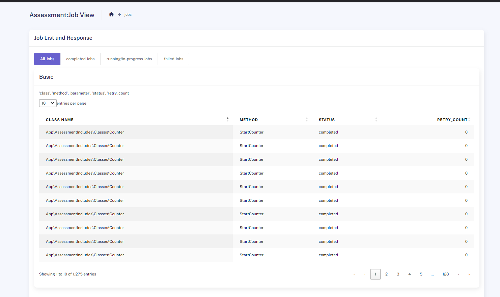

## About Laravel Assessment: Keith Msimango

To Execute a job from script directly in the project source code

Navigate to the Following Folder: 
App -> AssessmentIncludes folder 

_to run the code Please follow the following script methods_ 
 
`php BackgroundScript.php classname method name params`

 
Example command line execution in the same directory <b><u>App/AssessmentIncludes</u></b> :

`php BackgroundScript.php BackgroundScript.php App\\Jobs\\ExampleRunBackgroundJob1 create 'sam','has','breakfast'`

or
Example of Real test Scenario

`php app/AssessmentIncludes/BackgroundScript.php counter startCounter 10`

This should give you a response of success or failure in the command, whether your job has been triggered to be ran. 

if successful: running this script: will give u the exact command in `" QUOTES "` that you can execute using the `php artisan` command for future use

___
<h2> Application Plugins </h2>
<h4> PHP Plugins</h4>
<ul>
    <li> spatie/laravel-view-models <pre> More information goto: <a href="https://github.com/spatie/laravel-view-models">GITHUB</a></pre></li>
    <li> yajra/laravel-datatables-oracle <pre> More information goto: <a href="https://github.com/yajra/laravel-datatables-docs"> GITHUB </a></pre></li>

</ul>

<h4> Extra cool PHP functions, classes & features used </h4>
<ul>
<li> Found new ways to make sure that the both windows and Unix can run the same command

`start /B php %s artisan job:run_background_job %s %s "%s"`

</li> 

<li> Making sure that the class name is an instance of the laravel app

`app(self::getClassName($class_name))`
this returns the object of the class

while
`self::getClassName($class_name)` returns the only full class's string name

<li> <i> using p </i> 
</li>

</ul>

___
TO View Jobs history:

base_url()/dashboard

route-name = home
http://assessementeyona.loc/dashboard

